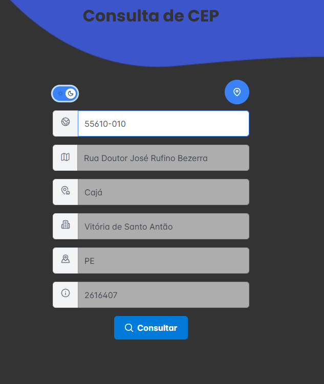
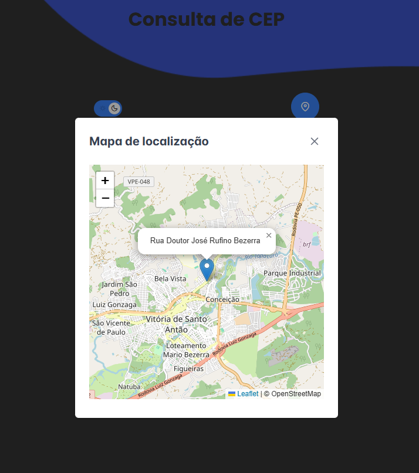

# Zip code search

ZIP code search system with geolocation display on the map.

## Description

ZIP code search system with geolocation display on the map, based on the address obtained through the search via the entered ZIP code.

## Technologies used

- Angular
- Leaflite
- Nominatim Open-source geocoding
- PrimeNG
  
## Installation

## Prerequisites

- Node.js 18+
- Angular CLI 17.3.8
- PrimeNG 17.18.15
- Leaflite 1.9.4

## Step by step
  1. Clone the repository to your local machine:
      ```sh
        https://github.com/H3lii0/zipcode-search.git
      ```
  2. Install dependences:
      ```sh
        npm install
      ```     
  3. Run the application using NG SERVE:
     ```sh
       ng serve
     ```

## Features

- ZIP code lookup
- Geolocation map display according to address
- Change page theme

## How to use

<p align="center">
  
  
</p>

<p align="center">
  
</p>

## Acknowledgements and Credits

This project uses:

- [API ViaCEP](https://viacep.com.br) — to search for addresses by zip code.
- [OpenStreetMap](https://www.openstreetmap.org/) — to display location maps.
- [PrimeNG](https://www.primefaces.org/primeng/) — UI component library.
- [Leaflet](https://leafletjs.com/) — open-source library for interactive maps.

## License

This project is licensed under the terms of the MIT license.  
See the [LICENSE](LICENSE) file for more details.

## Developed by

Hélio Miranda 
[LinkedIn](https://www.linkedin.com/in/helio-miranda-dev/) | [GitHub](https://github.com/H3lii0)
